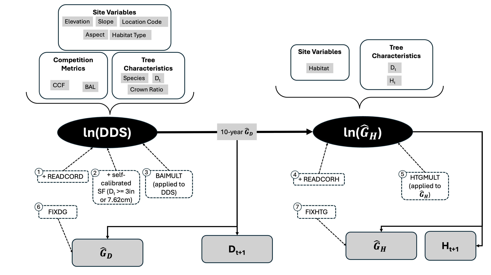

## Introduction

Forests can limit global warming because they can sequester carbon that would otherwise be atmospheric CO~2~ [@munro2025; @marvin2023; @smyth2014]. As such, forests are a key source for carbon credits [@gorain2025] and are increasingly being managed for carbon sequestration in addition to other management goals such as timber harvest, wildlife habitat, and recreation [@marvin2023]. Managing for carbon requires accurate estimates of current and future carbon stocks by principle [@munro2025] and, for managers seeking to sell carbon credits, by regulation [@arbcomp2013]. Carbon sequestration in live trees over time is a core component of forest carbon stocks. Because sequestration is driven by tree growth, modeling future carbon stocks requires accurate predictions of tree growth. Additionally, understanding how management for carbon affects possible merchantable timber yield – and therefore the economic sustainability of management operations – requires accurate prediction of tree volumes.

Forest growth and yield models are essential tools for predicting future carbon and tree volumes. Many possible growth and yield models exist, each with different histories, strengths, and weaknesses [@weiskittel2011]. By definition, models are necessary abstractions. Each model is designed using simplifying assumptions to enable prediction and inference. When using a model to inform management, these assumptions may lead to unrealistic or unexpectedly inaccurate results that could mislead decision-makers. Thus, it is essential to understand the assumptions underlying the particular models used for management, assess how assumptions affect model performance, and correct for those assumptions as necessary.

The Forest Vegetation Simulator (FVS) is a widely used collection of growth and yield models developed by the United States Forest Service [@crookston2005; @joo2025]. The Inland Empire variant of FVS (FVS-IE), covering western Montana, northern Idaho, and eastern Washington, was first developed as the Prognosis model for pure lodgepole pine (*Pinus contorta*) stands by @stage1973 and was further modified to include other common Rocky Mountain tree species (including western larch *Larix occidentalis* and Douglas-fir, *Pseudotsuga menziesii*).+

Western white pine (*Pinus monticola*), western larch (*Larix occidentalis*), Douglas-fir (*Pseudotsuga menziesii*), grand fir (*Abies grandis*), western hemlock (*Tsuga heterophylla*), western redcedar (*Thuja plicata*) by @wykoff1990 using data from \> 44,000 trees across the northern Rockies. FVS-IE has been regularly updated to use "best available" data [@dixon2002] since its initial development in the 70s, but the core logic of the model has remained the same (@fig-fvs-diagram). Large trees ($\geq$ 3" DBH) are projected forward in time by estimating diameter increment first, followed by height increment (@fig-fvs-diagram). Diameter growth ($\widehat G_D$) for each individual tree is estimated as squared inside bark diameter (DDS, calculated as $(D_\text{inside bark} + \widehat G_D)^2 – D_\text{inside bark}^2)$ using a combination of site variables, competition metrics, and tree characteristics. An error, drawn from a normal distribution with mean 0 and variance based on the regression that developed the diameter growth model, is added to the estimate to allow random effects. The resulting value is then used alongside habitat type and tree size (DBH, notated as $D_0$, and height) to estimate height growth ($\widehat G_H$; @fig-fvs-diagram). The model's default coefficients for the diameter increment component of the model were originally developed using increment core data [@wykoff1990], whereas the coefficients for the height increment component of the model were originally developed using 10-year height measurements from a separate set of felled trees [@stage1975].

::: {#fig-fvs-diagram}


FVS-IE core large tree growth model. From top to bottom: white boxes with solid outlines are input variables; black ovals are key model components estimated using input variables; white boxes with dashed outlines are optional keywords for calibration; and solid grey boxes are model outputs. Solid black arrows represent model processes that are always carried out. Calibration keywords (white boxes with dashed outlines) are numbered by the order in which they are applied. Dashed black arrows represent optional model processes. $D_t, \, H_t$ = diameter at time $t$ and height at time $t$, respectively, $\widehat G_D$ = FVS-predicted diameter growth, $\widehat G_H$ = FVS-predicted height growth, SF = scale factor, CCF = crown competition factor, BAL = basal area in larger trees, DDS = squared inside-bark diameter increment $(D_\text{inside bark} + \widehat G_D)^2 – D_\text{inside bark}^2)$, similar to basal area increment.

:::

The large tree growth model relies on the assumption that tree growth is relatively homogeneous across stands that have the same site variables (elevation, slope, aspect, habitat type, and location code; @fig-fvs-diagram). However, FVS-IE has limited resolution in habitat type and location code because it is a regional growth model. Therefore, stands with identical site variables may still have meaningful variation in tree growth rates due to small-scale environmental factors (e.g., local climate). The violation of the assumption of homogeneous growth across local climates suggests that FVS-IE may inaccurately predict tree growth, volume, and carbon at local scales. The extent of this inaccuracy and methods for correcting for prediction errors are not well-known, yet they must be understood to ensure that FVS-IE can be a reliable tool for management.

Local calibration, or adjusting model outputs using a multiplicative or additive factor, can be an effective method for improving FVS accuracy [@cankaya2025; @swann2025; @cawrse2010; @diaz2018]. Presumably, this strategy is effective because it addresses the violation of the first assumption of homogeneity discussed above. The FVS-IE model architecture provides multiple ways to calibrate the large tree diameter growth model, including a built-in "self-calibration" routine that uses growth data provided with the input tree list.

Mechanisms for calibration (numbered boxes with dashed borders in @fig-fvs-diagram) differ by when in the projection cycle they are applied, what they are applied to, and how they attenuate. Calibration can take place before diameter/height increment projection (numbered boxes 1-5, including self-calibration in @fig-fvs-diagram) or after projections are made (numbered boxes 6 and 7; @fig-fvs-diagram). In the former case, adjustments to diameter growth rates affect projected height growth (@fig-fvs-diagram, see arrow labeled "10-year $\widehat G_D$"). In the latter case, adjustments to diameter do not affect height growth. The READCORD and READCORH keywords are applied before self-calibration (boxes 1, 4, and 2 respectively, in @fig-fvs-diagram), whereas BAIMULT and HTGMULT (boxes 3 and 5 in @fig-fvs-diagram) are applied after self-calibration. These methods of calibration also differ in whether they are additive or multiplicative. Self-calibrated scale factors, READCORD, and READCORH all represent intercepts added on the log-scale (boxes 1, 2, and 4 in @fig-fvs-diagram). In contrast, BAIMULT and HTGMULT function by multiplying untransformed growth estimates (boxes 3 and 5 in @fig-fvs-diagram). Calibration after projections are made must be done by multiplying untransformed estimates (boxes 6 and 7 in @fig-fvs-diagram). Unlike user-supplied scale factors (boxes 1, 3, 4, 5, 6, and 7 in @fig-fvs-diagram), self-calibrated scale factors (box 2 in @fig-fvs-diagram) gradually attenuate over the course of the simulation, causing long-term projections to approach model defaults. Because adding an intercept on the log-scale is equivalent to multiplying on the untransformed scale, I refer to both intercepts and growth multipliers as "scale factors." For a more in-depth discussion of which scale factors to use when, see @hamilton1994.

After selecting the appropriate keyword(s) to use to adjust tree growth to reflect local conditions, the scale factors themselves must be estimated. This step requires high-quality, consistently collected tree measurement data. Yet, tree growth data can be costly or difficult to obtain. Thus, the publicly available Forest Inventory and Analysis (FIA) national forest inventory (NFI) program is a promising source of calibration data. NFI data consist of tree measurements collected via a standard protocol every 5-10 years from field plots located across the country. There is one field plot for every 24 km2 of forest, and each plot consists of a cluster of four 169m2 subplots [@sampling2022a]. Due to this sampling design, FIA data are plentiful and spread across a wide variety of forest types, management histories, and environments.

In this project, I use FIA data to understand how local variation affects FVS prediction accuracy. To do so, I estimate scale factors (i.e., the ratio of FIA-remeasured growth to FVS-predicted growth) in a Bayesian hierarchical model, investigating how a proxy for drought stress and a metric of site competition contribute to FIA plot-level variation in FVS accuracy.

## Methods

Code in development is available on my GitHub: <https://github.com/sprachan/fvs-code/tree/main/fia_calib>. In that analysis code, I use an R package that I am currently developing (`rFVSIEtools` in the `fia-calib` code on my GitHub). Because this package is under development and not ready for public use, the repo is private. I can give access if desired.

### Data and Study Species

To evaluate how FVS-IE predictions deviate from remeasurements, I used publicly available tree remeasurement data from Forest Inventory and Analysis (FIA) plots in western Montana and northern Idaho. To avoid confounding effects of plot history when investigating deviation due to local-scale variation, I only retained data from plots that had no recent disturbance or treatment history. I limited this analysis to Douglas-fir (*Pseudotsuga menziesii*) and western larch (*Larix occidentalis*) growth because these are both common and commercially important species in the inland northwest. Both Douglas-fir and western larch are abundant in forests in the Northern Rockies, but the two species have different environmental specificity: Douglas-fir grows under a wider range of climate conditions [@psmesilvics] than does western larch [@laocsilvics]. This difference in environmental specificity may provide some insight into how climate variation affects the variation in FVS prediction accuracy. If climate is a main driver of local-scale prediction bias, then I expect that scale factors will be more variable at the tree-level for Douglas-fir than western larch because Douglas-fir inhabits a broader range of climates in the inland northwest.

To investigate how local-scale climate variables contribute to deviation from base FVS predictions, I used a gridded water balance model created by the National Park Service [@tercek2021; @tercek2023; @tercek]. This dataset includes annual and seasonal mean water balance parameters (actual evapotranspiration, potential evapotranspiration, and deficit) from 1981-2019 at 1km resolution. For this analysis, I used climatic water deficit from 1981-2019 as a climate predictor because it integrates a site's potential evapotranspiration relative to actual demand, serving as an indicator of drought stress. I used average water balance data over this time frame because trees are long-lived, so their growth integrates water balance parameters across long periods of time. However, FIA plot locations are fuzzed up to 0.8km on public lands and up to 1.6km on private lands for privacy. Thus, I calculated average climatic water deficit within 0.8km buffers around FIA plot locations on public lands and within 1.6km buffers around FIA plot locations on private lands.

### FVS Simulations

To generate uncalibrated FVS predictions, I ran FVS with self-calibration turned off. I simulated growth only for alive trees, turned tripling off (when tripling is on, FVS splits each tree record into three trees to stabilize random effects), and set the random seed to 2025 to ensure reproducibility.

### Modeling Scale Factors

Methods for calculating scale factors vary across the literature. FVS-IE uses median prediction error for self-calibration [@dixon2002]. Regression-based calibration has proven effective for the Southern variant of FVS [@cankaya2025] and the Central Rockies variant of FVS [@ex2014]. However, previous work has used linear regression exclusively to calculate scale factors by modeling some form of:

$$ \widehat D = \beta_0 + \beta_1 D $$

Where $\widehat D$ is the projected diameter after a certain period of time (i.e., the default FVS projection cycle length), $D$ is the remeasured diameter, and $\beta_i$ are regression coefficients. While this approach is effective, it fails leverage the ability of regression to quantify how plot and tree characteristics contribute to the magnitude and direction of calibration required. In contrast, I use regression to quantify how local-scale variation drives prediction error in FVS and how we may address this shortcoming.

To understand local-scale variables that contribute to deviation from "base" FVS-IE predictions and investigate spatial structure in deviation, I used a Bayesian hierarchical modeling (BHM) framework to model scale factors. The BHM approach formalizes the nested tree-within-plot structure, allowing each scale factor estimate to draw on information from the broader plot. I modeled the ratio of FIA remeasured diameter growth ($G$) to FVS projected diameter growth ($\widehat G$, @eq-gr) in relation to tree species, plot climatic water deficit (a proxy for drought stress), and stand density (in 1000 trees per hectare, a measure of crowding and thus competition).

$$
G_r = \frac{G}{\widehat G}
$$ {#eq-gr}

Notice that

$$
G = G_r\cdot \widehat G
$$

So $G_r$ represents the empirical scale factor required to correct FVS estimates.

The hierarchical model for the scale factor for tree $i$ in plot $j$ (notated $G_{r, \, ij}$) is illustrated in a directed acyclic graph (@fig-dag). 

:::{#fig-dag}

```{mermaid}
flowchart BT

 B["$$\beta_{i,j}$$"] & C["$$\sigma_{\text{tree}}$$"] --> A(("$$G_{r, \, ij}$$"))

E{{"$$[l]_{ij}$$"}} &  F["$$\alpha_j$$"] & G["$$\beta_l$$"]--> B

H["$$\beta_E$$"] & I{{"$$E_j$$"}} & J["$$\beta_{\rho}$$"] & K{{"$$\rho_j$$"}} & L["$$\beta_0$$"] & M["$$\sigma_\text{plot}$$"]--> F
```

Directed acyclic graph representing the model for the scale factor $G_{r, \, ij} = \frac{G_{ij}}{\widehat G_{ij}}$ for tree $i$ in plot $j$; $G_{ij}$ represents remeasured diameter growth and $\widehat G_{ij}$ represents FVS-projected diamter growth. $[l]$ is a binary variable indicating whether or not tree $i$ is a larch, $\alpha_j$ is a plot-specific intercept, $E_j = \frac{E_j-\overline E}{\text{sd}(E)}$ is standardized average water deficit for plot $j$, $\rho_j = \rho_j-\overline \rho$ is the centered initial density (in 1000s of trees per hectare) for plot $j$, $\beta_0$ is the plot adjustment when $E_j = \overline E$ and $\rho_j = \overline \rho$. $\sigma$ denotes a variance, with the subscript indicating the biological level that the variance enters the model. The response variable, $G_{r,\, ij}$, is in a circle, square boxes indicate parameters, and hexagons indicate predictors.
:::

Mathematically, I specified the model as:

$$
G_r \sim \text{Gamma} \left(\mu_\text{tree} = \beta_{ij}, \text{ sd} = \sigma_\text{tree}\right)
$$ {#eq-dg-model}

$$
\beta_{ij} = \exp(\alpha_j +  \beta_l [l]) 
$$ {#eq-sf-model}

$$
\alpha_j \sim \mathcal N(\mu_\text{plot} = \beta_0+\beta_E \cdot E_j +  \beta_\rho \cdot \rho_j, \text{ sd} = \sigma_\text{plot})
$$ {#eq-plot-model}

Let us consider each level of the model in turn.

At the first level (@eq-dg-model), I modeled the scale factor for a single tree $i$ in a plot $j$ as a random variable that follows a Gamma distribution because scale factors are strictly positive. That is, each empirical scale factor $G_r$ is drawn from a distribution with mean value $\beta_{ij}$, with noise quantified by $\sigma_\text{tree}$.

The Gamma takes two parameters; let $\alpha$ denote the shape parameter and $\gamma$ denote the rate parameter. Then, by moment matching, we can solve for these parameters in terms of the desired mean and standard deviation ($\mu_\text{tree}$ and $\sigma_\text{tree}$, above):

```{=latex}
\begin{align*}
\alpha &= \frac{\mu_\text{tree}^2}{\sigma_\text{tree}^2}\\
\gamma &= \frac{\mu_\text{tree}}{\sigma_\text{tree}^2}
\end{align*}
```

FIA crews only remeasure diameter to the nearest 0.1". In consequence, if a tree grew less than 0.05" between measurements, it will be recorded with diameter growth 0. Thus, I calculated the likelihood for recorded diameter growth = 0 to be the gamma CDF (not pdf) from 0 to 0.05. For all other observations, I calculated the likelihood using the gamma pdf for that data value given the shape and scale parameters $\alpha$ and $\gamma$ described above.

I calculated the mean scale factor value, $\beta_{ij}$, using the deterministic model described in @eq-sf-model where the mean is the combination of a plot-level effect ($\alpha_j$) and a larch effect ($\beta_l [l]$). Note that the larch effect is an additional intercept for western larches, so $\alpha_j$ indicates the plot-level effect for a Douglas-fir. I chose Douglas-fir as the "baseline" species because it is more prevalent. I exponentiated this linear combination because the scale factor must be strictly positive but I wished to allow positive, negative, or zero $\alpha_j$ and $\beta_l$.

At the next level, I modeled the baseline scale factor adjustment due to plot effects, $\alpha_j$ (@eq-plot-model). Each $\alpha_j$ is drawn from a normal distribution with mean given by $\beta_0 + \beta_E \cdot E_j +  \beta_\rho \cdot \rho_j$., where $E_j$ is the plot-level average annual climatic water deficit and $\rho_j$ is a measure of plot density (in 1000 of trees per hectare, TPH). As described above, $E_j$ was standardized and $\rho_j$ was centered to improve computational efficiency and so that $\beta_0$ represented the average scale factor for a Douglas-fir in a stand with average density and deficit.

In summary, we are interested in the posterior $\mathbb P(\beta_{ij}, \sigma_\text{tree}, \beta_l, \alpha_j, \beta_E, \beta_\rho, \beta_0, \sigma_\text{plot}|G_r)$. By Bayes theorem and conditional independence, we have:

$$
\begin{split}
\mathbb P(\beta_{ij}, \sigma_\text{tree}, \alpha_j, \beta_E, \beta_\rho, \beta_l, \beta_0, \sigma_\text{plot}|G_r) \propto & \mathbb P(G_r|B_{ij}, \sigma_\text{tree}) \mathbb P(\beta_{ij}|\alpha_j, \beta_l) \cdot\\ & \mathbb P(\alpha_j|\beta_E, \beta_\rho, \beta_0, \sigma_\text{plot}) \cdot \\ &\mathbb P(\sigma_\text{tree})\mathbb P(\beta_s)\mathbb P(\beta_E)\mathbb P(\beta_\rho)\mathbb P(\beta_0)\mathbb P(\sigma_\text{plot})
\end{split}
$$ {#eq-sf-posterior}

I specified weakly informative prior distributions for each parameter (@tbl-prior-distributions). Note that the prior distributions for $\beta_{i,j}$ and $\alpha_j$ are given as @eq-sf-model and @eq-plot-model, respectively.

::: {#tbl-prior-distributions}
| Parameter | Prior Distribution | Justification |
|------------------|-------------------------------|-----------------------|
| $\sigma_\text{plot}$, $\sigma_\text{tree}$ | Half-normal(0, 1) | Standard deviations must be strictly positive, and I expected them to be small. |
| $\beta_l$ | $\mathcal N(0, 0.5)$ | This softly constrains $e^{\beta_l}$ to be near 1, with room to wander towards 0 and out to about 3.5, which is more than enough room for scale factors (according to FVS documentation, scale factors should typically fall between 0.5 and 2.0). |
| $\beta_E$, $\beta_\rho$ | $\mathcal N(0, 0.75)$ | Similar to $\beta_l$, but slightly less constrained. |

Prior distributions for estimated parameters.
:::

-   $\beta_{D_0}, \beta_\rho, \beta_s \sim \mathcal N(0, 2)$ because I expect the effects to be relatively small but I am unsure about the sign, and these coefficients can take on any value in $\mathbb R$.
-   $\sigma_1 \sim \text{half-Cauchy}(0, 5)$. The half-Cauchy is a lot like the half normal, but it has heavier tails and therefore allows more extreme values.

### TO DO STILL

I will use posterior predictive checks to assess model fit. I will also visually compare posterior distributions to prior distributions to assess how informative the data were relative to the prior. I am working on fitting the third level of the model (including density and deficit as predictors). I got an initial version up and running, but I need more time to rerun with standardized predictors, visualize, and think about the results.

I also planned to add spatial level by having $\alpha_j$ be multivariate normal with spatial structured covariance matrix, but this may have to wait until after the semester is over.

## Results and some Discussion

I currently have had success running the first and second level model (scale factor only, then scale factor with randomly drawn plot effect, species effect, and size effect). These are the preliminary results I present here. Corresponding Stan Code is before the references.

For these preliminary results, I compared scaled and unscaled predictions using posterior mean $\beta_{i,j}$ values. This was simple to extract from the first model (I took the mean of the posterior draws for $\beta$). I used a similar process for the second level, but it was a bit more involved (posterior mean $\overline \beta_{ij} = \text{exp}(\overline \alpha_j+\overline \beta_{D_0}D_{0,i}+\overline \beta_ss_i)$).

```{r}
#| eval: false
#| echo: false

suppressMessages(library(here))
library(ggplot2)
library(patchwork)
suppressMessages(library(viridis))
compare_growth <- readRDS(here('data', 'sim_outputs', 'uc_compare_growth.rds'))
first_lev <- readRDS(here('model_outputs', 'first_level_fit.RDS'))
second_lev <- readRDS(here('model_outputs', 'second_level_fit.RDS'))

p1 <- ggplot(compare_growth, aes(x = dg_FIA, y = dg_FVS,
                                 col = initial_dbh))+
  geom_point(alpha = 0.5, size = 1)+
  coord_fixed(xlim = c(0, 8), ylim = c(0, 8))+
  geom_abline(slope = 1, intercept = 0, col =  'black', lty = 'dashed', lwd = 1)+
  labs(x = 'FIA Diameter Growth (Diameter 2 - Diameter 1)',
       y = 'FVS Diameter Growth',
       title = 'Unscaled Predictions',
       color = 'Initial Diameter')+
  scale_color_viridis()+
  theme_bw()

p2 <- ggplot(compare_growth, aes(x = dg_FIA, y = dg_FVS*mean(first_lev$beta), 
                                 col = initial_dbh))+
  geom_point(alpha = 0.5, size = 1)+
  coord_fixed(xlim = c(0, 8), ylim = c(0, 8))+
  geom_abline(slope = 1, intercept = 0, col =  'black', lty = 'dashed', lwd = 1)+
  labs(x = 'FIA Diameter Growth \n (Diameter 2 - Diameter 1)',
       y = 'Scaled FVS Diameter Growth',
       title = 'Scaled Predictions (1st level)',
       color = 'Initial Diameter')+
  scale_color_viridis()+
  theme_bw()

plot_means <- data.frame(plot_eff = apply(second_lev$alpha_plot, MARGIN = 2, FUN = mean),
                         PID = unique(compare_growth$PID))
                    
compare_growth$spec_eff <- ifelse(compare_growth$SPECIES == 73, 
                                  mean(second_lev$beta_species[,1]), # larch
                                  mean(second_lev$beta_species[,2])) # doug fir
cg2 <- merge(compare_growth, plot_means)
cg2$scaled_pred <- cg2$dg_FVS*exp(cg2$plot_eff+mean(second_lev$beta_size)*cg2$initial_dbh+cg2$spec_eff)
p1
```

In the above plot, the dashed black line is the 1:1 line. Note the banding pattern on the x-axis is due to the fact that FIA measurements are rounded to the nearest 0.1", whereas FVS predictions are truly continuous. If FVS was unbiased, we would expect points to all fall roughly along the 1:1 line, with noise. Clearly, this is not the case. Moreover, there appears to be a pattern in initial diameter, though this is a bit tricky to parse. Smaller tree growth (darker colors), which make up the bulk of the data, is generally over predicted even more than larger tree growth (lighter colors; i.e., darker points lie further above the 1:1 line than do lighter points). The absolute largest trees appear to have under-predicted diameter growth (very light points under the 1:1 line), though this is a bit difficult to see.

```{r}
#| eval: false
#| echo: false
p3 <- ggplot(cg2, aes(x = dg_FIA, y = scaled_pred,
                      col = initial_dbh))+
  geom_point(alpha = 0.5, size = 1)+
  coord_fixed(xlim = c(0, 8), ylim = c(0, 8))+
  geom_abline(slope = 1, intercept = 0, col =  'black', lty = 'dashed', lwd = 1)+
  labs(x = 'FIA Diameter Growth \n (Diameter 2 - Diameter 1)',
       y = 'Scaled FVS Diameter Growth',
       title = 'Scaled Predictions (2nd level)',
       color = 'Initial Diameter')+
  scale_color_viridis()+
  theme_bw()

p2

p3

```

As before, the dashed black line is the 1:1 line. The first-level model, where I use a single scale factor to adjust all predictions, changes the dynamics somewhat. Rather than largely overpredicting, the scaled growth predictions are roughly equally over and under what they should be (i.e., density of points is roughly equal above and below the 1:1 line). We haven't gotten rid of the problems by initial DBH (smaller trees are still over predicted more than larger trees) and scaled predictions are way below what they should be for some trees (points on the farthest right of the plot).

The second-level model is a different story. Now, we have much better alignment with the 1:1 line, though we are still underpredicting a fair amount of trees (far right below the 1:1 line). It's hard to tell what is going on with initial DBH because of the sheer quantity of data. At first glance, it appears that there is more random scatter of initial DBH values about the 1:1 line, which is what we would expect from a model that is not biased WRT initial DBH. However, it looks like we may be over-predicting larger trees now. Let's look more closely:

```{r}
#| echo: false
#| eval: false
p4 <- cg2[cg2$initial_dbh >= 20,] |>
  ggplot(aes(x = dg_FIA, y = scaled_pred,
                      col = initial_dbh))+
  geom_point(alpha = 0.5)+
  coord_fixed()+
  geom_abline(slope = 1, intercept = 0, col =  'black', lty = 'dashed', lwd = 1)+
  labs(x = 'FIA Diameter Growth \n (Diameter 2 - Diameter 1)',
       y = 'Scaled FVS Diameter Growth',
       title = 'Scaled Predictions (2nd level, D0 >= 20")',
       color = 'Initial Diameter')+
  scale_color_viridis()+
  theme_bw()
p4
```

Indeed, we are now somewhat overpredicting DBH growth for larger trees. Because of how FVS keywords work, I was considering fitting $\beta_{D_0}$ for categorical rather than continuous $D_0$. However, I don't want to lose the resolution of the data I get from using continuous $D_0$. Instead, I should perhaps include a squared term; it looks like my current formulation, where the scale factor is log-linear WRT initial diameter, accurately reflects the actual relationship in the data. A quadratic term would allow the (log) scale factor to increase with initial DBH up to a certain threshold, then it begins to decrease again. More exploration is warranted.

A question I have for you is: given that FIA data are rounded, should I consider including a model for rounding? That is, should I use the CDF to calculate the likelihood for every observation? For example, the likelihood for a FIA diameter growth value of 0.1 would be the lognormal CDF($[0.05, 0.15)|\alpha, \gamma$) and the likelihood for a FIA diameter growth value of 0.2 would be $\log \mathcal N \text{CDF}([0.15,0.25))$, where $\alpha, \gamma$ are the log normal parameters. Would this be overly complicated? Everybody uses rounded data in practice because instruments have finite precision, and I can't think of any papers I've read where authors explicitly accounted for rounding. So should I care?

## Stan Code

First-level model:

```         

functions{
  real lognormal_zeroes_lpdf(vector y, vector location, vector scale){
    vector [num_elements(y)] llk;
    for(i in 1:num_elements(y)){
        // Recorded DG of 0 could actually be from 0" to 0.05".
        // Thus, we want to give the cumulative probability that DG is in 
        // [0, 0.05] 
      if (y[i] == 0) 
        // recorded DG = 0 means actual could be anywhere from 0-0.05.
        llk[i] = lognormal_lcdf(0.05|location[i], scale[i]); 
      else
        llk[i] = lognormal_lpdf(y[i]|location[i], scale[i]);
    }
    return sum(llk);
}
}

data {
  int<lower=0> N;
  vector[N] dg_fvs;
  vector[N] dg_fia;
}


parameters {
  real<lower=0> beta;
  real<lower=0> sigma;
}

transformed parameters{
  // mean for each observation depends on dg_fvs
  vector<lower = 0>[N] mu = beta*dg_fvs;
  vector[N] location = log((pow(mu, 2))./sqrt(pow(mu, 2)+pow(sigma, 2)));
  vector[N] scale = log(1+pow(sigma, 2)./pow(mu, 2));
}

model {
  beta ~ gamma(2, 1);
  sigma ~ normal(0, 2);
  dg_fia ~ lognormal_zeroes(location, scale);
}
```

Second level model:

```         

functions{
  real lognormal_zeroes_lpdf(vector y, vector location, vector scale){
    vector [num_elements(y)] llk;
    for(i in 1:num_elements(y)){
      if (y[i] == 0) 
        // recorded DG = 0 means actual could be anywhere from 0-0.05.
        llk[i] = lognormal_lpdf(0.05|location[i], scale[i]); 
      else
        llk[i] = lognormal_lpdf(y[i]|location[i], scale[i]);
    }
    return sum(llk);
}
}

data {
  int<lower=0> N;
  int<lower=0> N_plots;
  int<lower=1> N_species;
  vector[N] dg_fvs;
  vector[N] dg_fia;
  vector[N] tree_size;
  matrix<lower=0>[N, N_species] species;
  array[N] int plot_id;
}


parameters {
  real beta_size;
  vector[N_species] beta_species;
  real<lower=0> sigma;
  vector[N_plots] alpha_plot;
}

transformed parameters{
  vector<lower=0>[N] mu; 
  mu = exp(alpha_plot[plot_id]+beta_size.*tree_size+species*beta_species).*dg_fvs;

  vector[N] location = log((pow(mu, 2))./sqrt(pow(mu, 2)+pow(sigma, 2)));
  vector[N] scale = log(1+pow(sigma, 2)./pow(mu, 2));
}

model {
  beta_size ~ normal(0, 2); // draw one value total
  sigma ~ cauchy(0, 2); // draw one value total
  alpha_plot ~ normal(0, 2); // draw one value PER PLOT
  beta_species ~ normal(0, 2);

  dg_fia ~ lognormal_zeroes(location, scale);
}
```

## References
