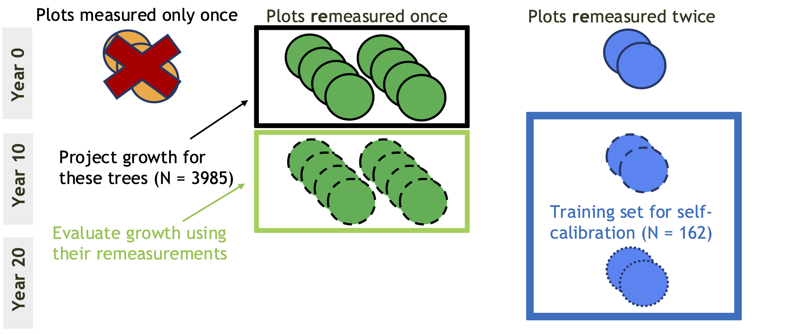

```{r}
#| label: preliminaries
#| collapse: TRUE
# Packages --------------------------------------------------------------------------
library(dplyr) # data wrangling
library(ggplot2) # plotting
theme_set(theme_bw()) # default plot theme
library(patchwork) # composing plots into figures
library(usmap) # montana state outline reference
library(terra) # spatial data tools
library(sf) # spatial data tools
library(here) # helps avoid .qmd's default behavior of wd = qmd directory

# Functions and file paths -----------------------------------------------------------
source(here('00_functions.R'))
project <- FALSE # don't want to actually project in FVS
if(project){
  source(here('01_setup.R')) # needed for running FVS
}else{
  fvs_ready <- here('data', 'fvs_ready')
  fvs_runs <- here('data', 'fvs_runFiles')
  sim_out <- here('data', 'sim_outputs')
  fia_sql <- here('data', 'fia', 'SQLite_FIADB_MT.db')
}


# Data -------------------------------------------------------------------------------
## Species table, for reference
species_tab <- fvs_spcd(fia_sql)

## FIA Data ----
standInit <- readRDS(file.path(fvs_ready, 'FVSstandInitAll.rds'))
treeInit <- readRDS(file.path(fvs_ready, 'FVStreeInitAll.rds'))

# filter to Inland Empire only
standInitIE <- filter(standInit,
                      VARIANT == 'IE',
                      substr(ECOREGION, 1, 5) == 'M332B') |>
  arrange(PID, INV_YEAR) |>
  group_by(PID) |>
  mutate(
    # REMeasurement code
    REM_CD = case_when(INV_YEAR == min(INV_YEAR) ~ 0, # first measurement
                       n() == 2 ~ 1, # first remeasurement
                       INV_YEAR == max(INV_YEAR) ~ 2, # second remeasurement
                       INV_YEAR != max(INV_YEAR) ~ 1, # first remeasurement
                       .default = NA),
    # Number of REMeasurements
    N_REM = max(REM_CD),
    # string padding for FVS compatibility
    FOREST = stringr::str_pad(FOREST, 
                              width = 2, 
                              pad = '0', 
                              side = 'left')) |>
  ungroup()

treeInitIE <- treeInit[treeInit$STAND_CN %in% standInitIE$STAND_CN,] |>
  dplyr::left_join(select(standInitIE, STAND_CN, INV_YEAR, REM_CD, N_REM), 
                   by = dplyr::join_by(STAND_CN))

## FVS runs ----
####### CODE GENERATING THESE OUTPUTS IS AT THE BOTTOM OF ALL THIS CODE #######
# Uncalibrated
uncalib_tr <- readRDS(here(sim_out, 'uncalib.RData')) |>
  dplyr::select(age, species, dbh, TUID, year) |>
  dplyr::rename(fvs_cd = species, fvs_age = age, fvs_dbh = dbh) |>
  dplyr::left_join(select(species_tab, fvs_cd, fia_cd),
                   by = join_by(fvs_cd))

# Multiplier calibrated
mult_tr <- readRDS(here(sim_out, 'mult_trees.RData')) |>
  dplyr::select(age, species, dbh, TUID, year) |>
  dplyr::rename(fvs_cd = species, fvs_age = age, fvs_dbh = dbh) |>
  dplyr::left_join(select(species_tab, fvs_cd, fia_cd),
                   by = join_by(fvs_cd))

# Study species: those with enough data for use in self calibration
study_species <-readRDS(here(sim_out, 'selfcalib_calbstat.RData'))$SpeciesFIA |>
  unique() |>
  as.numeric()

```

```{r}
#| label: eda

# Map FIA plots ----------------------------------------------------------------------
mt_map <- us_map(regions = 'county', include = 'Montana') # state outline
stand_locs <- vect(standInitIE, geom = c('LONGITUDE', 'LATITUDE'))

# FIA documentation tells us that they use NAD83 datum
crs(stand_locs) <- '+proj=longlat +ellps=GRS80 +towgs84=0,0,0,0,0,0,0 +no_defs +type=crs'

missoula_coords <- data.frame(LATITUDE = 46.87215,
                              LONGITUDE = -113.994) |>
  terra::vect(geom = c('LONGITUDE', 'LATITUDE'))
crs(missoula_coords) <- 'epsg:4326' # WGS84

missoula_coords <- project(missoula_coords, crs(mt_map)) |>
  st_as_sf()
stand_locs <- project(stand_locs, crs(mt_map)) |> # project stands to montana
  st_as_sf()

stand_map <- ggplot()+
  geom_sf(data = mt_map)+
  # don't want to plot the same plot on top of itself a bunch of times
  geom_sf(data = distinct(stand_locs, PID, .keep_all = TRUE), aes(color = factor(N_REM)), alpha = 0.75, size = 1)+
  geom_sf(data = missoula_coords, pch = '*', col = 'red', lwd = 5, size = 10)+
  theme_light()+
  labs(color = 'Number Remeasurements')+
  theme(legend.position = 'bottom')


```

```{r}
#| label: data-carpentry

# Connect tree list info with stand info ---------------------------------------------
joiner <- treeInitIE |>
  dplyr::select(AGE, DIAMETER, TUID, PID, STAND_CN, REM_CD) |>
  # need to get inventory year from stand info
  dplyr::left_join(dplyr::select(standInit,
                                 STAND_CN, INV_YEAR),
                   by = dplyr::join_by(STAND_CN)) |>
  dplyr::rename(fia_age = AGE, fia_dbh = DIAMETER, year = INV_YEAR)

# one comparison dataframe for each run
uncalib_comp <- dplyr::left_join(uncalib_tr, joiner, 
                                 by = dplyr::join_by(TUID, year)) |>
  dplyr::filter(fia_cd %in% study_species,
                fia_dbh > 0.1) |>
  dplyr::mutate(model = 'uncalibrated',
                dbh_group = cut(fia_dbh, breaks = c(1, 21, 41),
                                right = FALSE, include.lowest = TRUE,
                                labels = FALSE),
                group_name = dplyr::case_when(dbh_group == 1 ~ 'DBH Group 1',
                                              dbh_group == 2 ~ 'DBH Group 2',
                                              .default = NA),
                tolerance = 0.1*dbh_group)

mult_comp <- dplyr::left_join(mult_tr, joiner,
                              by = dplyr::join_by(TUID, year)) |>
  dplyr::filter(fia_cd %in% study_species,
                fia_dbh > 0.1) |>
  dplyr::mutate(model = 'multiplier',
                dbh_group = cut(fia_dbh, breaks = c(1, 21, 41),
                                right = FALSE, include.lowest = TRUE,
                                labels = FALSE),
                group_name = dplyr::case_when(dbh_group == 1 ~ 'DBH Group 1',
                                              dbh_group == 2 ~ 'DBH Group 2',
                                              .default = NA),
                tolerance = 0.1*dbh_group)

# overall comparison dataframe
comp <- rbind(uncalib_comp, mult_comp) |>
  dplyr::mutate(prediction_err = fvs_dbh-fia_dbh)

# version of comparison dataframe that only includes projection year
comp_rem <- dplyr::filter(comp, REM_CD == 1)
comp_rem_summ <- comp_rem |>
  group_by(model) |>
  summarize(err_mean = mean(prediction_err),
            n = n(),
            se = sd(prediction_err)/sqrt(n()))

# sanity check
check <- dplyr::filter(uncalib_comp, REM_CD == 0) 
plot(check$fvs_dbh, check$fia_dbh, pch = 20, col = rgb(0, 0, 0, 0.5),
     main = 'Uncalibrated sanity check') 
abline(coef = c(0, 1), col = 'red')

check <- dplyr::filter(mult_comp, REM_CD == 0) 
plot(check$fvs_dbh, check$fia_dbh, pch = 20, col = rgb(0, 0, 0, 0.5),
     main = 'Adjusted multipliers sanity check') 
abline(coef = c(0, 1), col = 'red')

# Multipliers ----------------------------------------------------------------------------------------------------------------
mults <- dplyr::select(readRDS(here(sim_out, 'selfcalib_calbstat.RData')), 
                       TreeSize, 
                       SpeciesPLANTS, 
                       SpeciesFIA,
                       NumTrees, 
                       ScaleFactor, 
                       ReadCorMult) |>
  dplyr::summarize(.by = c(TreeSize, SpeciesPLANTS, SpeciesFIA),
                   n = sum(NumTrees),
                   avgScaleFactor = mean(ScaleFactor, na.rm = TRUE),
                   avgReadCorMult = mean(ReadCorMult, na.rm = TRUE))
```

```{r}
#| label: visualize-errors

# Visualize Errors -------------------------------------------------------------------
# Plot predictions vs observations 
pred_obs_plt <- comp_rem |>
  mutate(model_clean = case_when(model == 'uncalibrated' ~ 'Uncalibrated',
                                 model == 'multiplier' ~ 'Multiplier Calibrated'),
         model_clean = factor(model_clean, levels = c('Uncalibrated',
                                                      'Multiplier Calibrated'),
                              ordered = TRUE)) |>
  ggplot(aes(x = fia_dbh, y = fvs_dbh))+
  geom_point(alpha = 0.25)+
  facet_wrap(facets = vars(factor(model_clean)))+
  geom_abline(aes(intercept = 0, slope = 1), col = 'red')+
  labs(x = 'FIA remeasured DBH, in', y = 'FVS projected DBH, in')

# By species
pred_obs_spec_plt <- comp_rem |>
  left_join(fvs_spcd(fia_sql), by = join_by(fia_cd)) |>
  ggplot(aes(x = fia_dbh, y = fvs_dbh, color = factor(sp_abb)))+
  geom_point(alpha = 0.25)+
  facet_grid(rows = vars(factor(model)),
             cols = vars(factor(sp_abb)))+
  geom_abline(aes(intercept = 0, slope = 1))+
  coord_fixed()+
  labs(x = 'FIA remeasured DBH, in', y = 'FVS projected DBH, in',
       color = 'Species')+
  theme(legend.position = 'bottom')

# Error distribution
err_hist <- ggplot()+
  geom_histogram(data = comp_rem, 
                 aes(x = prediction_err),
                 bins = 30, col = 'black', fill = 'lightgrey')+
  geom_vline(data = comp_rem_summ,
             aes(xintercept = err_mean), 
             col = 'red')+
  geom_vline(xintercept = 0, lty = 'dashed')+
  facet_wrap(facets = vars(factor(model,
                                  levels = c('uncalibrated', 'multiplier'),
                                  labels = c(uncalibrated = 'Uncalibrated',
                                             multiplier = 'Multiplier Calibrated'),
                                  ordered = TRUE)),
             nrow = 1)+
  geom_text(data = comp_rem_summ,
            aes(label = paste(round(err_mean, 2), 
                              '\u00B1', 
                              round(se, 2)),
                y = 1250, x = 5))+
  labs(x = 'Prediction Error (Predicted - Observed DBH, in)',
       y = 'Count')

```

```{r}
#| label: stats
# Equivalence testing ----------------------------------------------------------
group1 <- filter(comp_rem, dbh_group == 1)
group2 <- filter(comp_rem, dbh_group == 2)

# Uncalibrated
g1_uc_tost <- equivalence::tost(group1$fvs_dbh[group1$model == 'uncalibrated'],
                                group1$fia_dbh[group1$model == 'uncalibrated'],
                                epsilon = 0.1,
                                paired = TRUE,
                                alpha = 0.05)

g2_uc_tost <- equivalence::tost(group2$fvs_dbh[group2$model == 'uncalibrated'],
                                group2$fia_dbh[group2$model == 'uncalibrated'],
                                epsilon = 0.2,
                                paired = TRUE,
                                alpha = 0.05)

# Multiplier 
g1_mult_tost <- equivalence::tost(group1$fvs_dbh[group1$model == 'multiplier'],
                                  group1$fia_dbh[group1$model == 'multiplier'],
                                  epsilon = 0.1,
                                  paired = TRUE,
                                  alpha = 0.05)

g2_mult_tost <- equivalence::tost(group2$fvs_dbh[group2$model == 'multiplier'],
                                  group2$fia_dbh[group2$model == 'multiplier'],
                                  epsilon = 0.2,
                                  paired = TRUE,
                                  alpha = 0.05)
# For trees >= 5 but <= 20
group1c <- filter(group1, fia_dbh >= 5)
g1_mult_tostc <- equivalence::tost(group1c$fvs_dbh[group1$model == 'multiplier'],
                                   group1c$fia_dbh[group1$model == 'multiplier'],
                                   epsilon = 0.1,
                                   paired = TRUE)

# NHST ------------------------------------------------------------------------
# Testing for difference from 0
uc_diff_t <- t.test(comp_rem$prediction_err[comp_rem$model == 'uncalibrated']) 
mult_diff_t <- t.test(comp_rem$prediction_err[comp_rem$model == 'multiplier'])

# Testing for difference from each other
uc_mult_t <- t.test(comp_rem$prediction_err[comp_rem$model == 'uncalibrated'],
                    comp_rem$prediction_err[comp_rem$model == 'multiplier'],
                    paired = TRUE)

# large trees only
uc_diff_lg_t <- t.test(comp_rem$prediction_err[comp_rem$model == 'uncalibrated'&
                                                    comp_rem$fia_dbh>=5])

uc_mult_lg_t <- t.test(comp_rem$prediction_err[comp_rem$model == 'multiplier'&
                                                    comp_rem$fia_dbh>=5])

```

```{r}
#| label: fvs-run-code
########################### CODE TO RUN FVS ###########################
# don't actually want to run while knitting because requires FVS build and 
#> takes a long time, so use project = FALSE

project <- FALSE
if(project){
# Uncalibrated Run -----------------------------------------------------------------
## Tree and Stand lists ----
  t0_stands <- filter(standInitIE, N_REM == 1, REM_CD == 0) |>
    dplyr::select(-N_REM, -REM_CD) |>
    as.data.frame()

  t0_trees <- dplyr::filter(treeInitIE, STAND_CN %in% t0_stands$STAND_CN) |>
    clean_FIA_treeList(standinfo = standInitIE)
  
## Run projection ----
# make directory. Use date and time to help with ID later
  dt <- paste0('uc_', format(Sys.Date(), '%b%d%Y'), '_', 
               format(Sys.time(), '%H.%M'), collapse = '')
  outdir <- file.path(fvs_runs, dt)
  dir.create(outdir)
  filenames <- rep(NA, nrow(t0_stands))
  
  # projection parameters
  num_years <- 11 # number of years into the future to project
  use_tripling <- FALSE
  use_calibration <- FALSE
  use_regenmodel <- FALSE
  
  # FVS will  overwrite each stand, so we need storage
  uncalib_proj <- list()
  uncalib_proj$treelist <- NULL
  uncalib_proj$summary <- NULL
  
  for(i in 1:nrow(t0_stands)){
    st <- t0_stands[i,]
    tr <- t0_trees[t0_trees$STAND_CN == st$STAND_CN,] |>
      as.data.frame()
    
    # check if there are eligible trees to simulate
    if(sum(tr$HISTORY %in% 6:9) == nrow(tr)){
      cat('Skipping stand ', st$STAND_CN, ' (PID ', st$PID, ') \n', sep = '')
    }else{
      # run simulation
      tr$fvs.TREE_ID <- 1:nrow(tr)
      rFVS::fvsLoad("FVSie", fvs_bin)
      filenames[i] <- write.FVSfiles(trees=tr,
                                     stand=st,
                                     years_out=num_years,
                                     calibrate=use_calibration,
                                     triple=use_tripling,
                                     add_regen=use_regenmodel,
                                     outdir = outdir,
                                     file_prefix = paste0('uncalib_stand', i),
                                     STDIDENT = paste0('UNCALBST', i))
      
      # grow the stand
      fvsSetCmdLine(paste0("--keywordfile=",filenames[i],".key"))
      
      y <- c(st$INV_YEAR, st$INV_YEAR+10)
      # get grown tree list
      fvs_output <- fvsInteractRun(AfterEM1='fetchTrees()',
                                   SimEnd=fvsGetSummary)
      names(fvs_output)
      
      # 2007 tree list in element 1, just to check
      tl1 <- fvs_output[[1]]$AfterEM1 |>
        dplyr::left_join(select(tr, fvs.TREE_ID, TUID, PID),
                         by = dplyr::join_by(id == fvs.TREE_ID))
      nrow(tl1)
      # 2017 tree list output in element 2. use left_join to match up with TUID
      tl2 <- fvs_output[[2]]$AfterEM1 |>
        dplyr::left_join(select(tr, fvs.TREE_ID, TUID, PID),
                         by = join_by(id == fvs.TREE_ID))
      nrow(tl2)
      tl <- rbind(tl1, tl2)
      nrow(tl)
      uncalib_proj$treelist <- rbind(uncalib_proj$treelist, tl)
      
      # similar with plot summaries
      uncalib_proj$summary <- rbind(uncalib_proj$summary,
                                    cbind(fvs_output[[length(fvs_output)]],
                                          data.frame(PID = st$PID)))
    }
    
    
    rFVS::fvsLoad("FVSie", fvs_bin)
  }
## Save outputs ----
saveRDS(uncalib_proj$treelist, file = here(sim_outputs, 'uncalib.RData'))
saveRDS(uncalib_proj$summary, file = here(sim_outputs, 'uncalibsummary.RData'))
        
# Run to calculate scale multipliers using self-calibration -------------------------
## Tree and stand lists ----
t2_stands <- dplyr::filter(standInitIE, REM_CD == 2) |>
    dplyr::arrange(PID) |>
    dplyr::mutate(FOREST = as.numeric(FOREST)) |>
    as.data.frame()
  nrow(t2_stands) # only 5 plot IDs
   # checked by hand and saw that PIDs match up
  t2_stands$REM_INT <- plot_rems$INV_YEAR.x - plot_rems$INV_YEAR.y
  
  t2_trees <- filter(treeInitIE, STAND_CN %in% t2_stands$STAND_CN) |>
    clean_FIA_treeList(standinfo = standInitIE) |>
    as.data.frame()
  
## FVS run ----
# make directory. Use date and time to help with ID later
  dt <- paste0('sc_', format(Sys.Date(), '%b%d%Y'), '_', 
               format(Sys.time(), '%H.%M'), collapse = '')
  outdir <- file.path(fvs_runs, dt)
  dir.create(outdir)
  filenames <- rep(NA, nrow(t2_stands))
  
  # projection parameters
  num_years <- 11 # number of years into the future to project
  use_tripling <- FALSE
  use_calibration <- TRUE
  use_regenmodel <- FALSE
  
  # FVS will  overwrite each stand, so we need storage
  selfcalib_proj <- list()
  selfcalib_proj$treelist <- NULL
  selfcalib_proj$summary <- NULL
  selfcalib_proj$calibstats <- NULL
  
  for(i in 1:nrow(t2_stands)){
    st <- t2_stands[i,]
    tr <- t2_trees[t2_trees$STAND_CN == st$STAND_CN,] |>
      as.data.frame()
    if(sum(tr$HISTORY %in% 6:9) == nrow(tr)){
      cat('Skipping stand ', st$STAND_CN, ' (PID ', st$PID, ') \n', sep = '')
    }else{
      tr$fvs.TREE_ID <- 1:nrow(tr)
      rFVS::fvsLoad("FVSie", fvs_bin)
      filenames[i] <- write.FVSfiles(trees=tr,
                                     stand=st,
                                     years_out=num_years,
                                     calibrate=use_calibration,
                                     triple=use_tripling,
                                     add_regen=use_regenmodel,
                                     file_prefix = paste0('selfcalib_stand', i),
                                     outdir = outdir,
                                     STDIDENT = paste0('SELFCALB', i))
  
      # grow the stand
      fvsSetCmdLine(paste0("--keywordfile=",filenames[i],".key"))
  
      y <- c(st$INV_YEAR, st$INV_YEAR+10)
      # get grown tree list
      fvs_output <- fvsInteractRun(AfterEM1='fetchTrees()',
                                   SimEnd=fvsGetSummary)
      names(fvs_output)
  
      # 2007 tree list in element 1, just to check
      tl1 <- fvs_output[[1]]$AfterEM1 |>
        dplyr::left_join(select(tr, fvs.TREE_ID, TUID, PID),
                         by = dplyr::join_by(id == fvs.TREE_ID))
      nrow(tl1)
      # 2017 tree list output in element 2. use left_join to match up with TUID
      tl2 <- fvs_output[[2]]$AfterEM1 |>
        dplyr::left_join(select(tr, fvs.TREE_ID, TUID, PID),
                         by = join_by(id == fvs.TREE_ID))
      nrow(tl2)
      tl <- rbind(tl1, tl2)
      nrow(tl)
  
  
      selfcalib_proj$treelist <- rbind(selfcalib_proj$treelist, tl)
  
      # similar with plot summaries
      selfcalib_proj$summary <- rbind(selfcalib_proj$summary,
                                    cbind(fvs_output[[length(fvs_output)]],
                                          data.frame(PID = st$PID)))
      # Get calibration statistics
      conn <- DBI::dbConnect(RSQLite::SQLite(), 'FVSOut.db')
      calib <- dplyr::tbl(conn, 'FVS_CalibStats') |>
        dplyr::collect()
  
      DBI::dbDisconnect(conn)
  
      selfcalib_proj$calibstats <- rbind(selfcalib_proj$calibstats, calib)
      remove(conn)
      file.remove('FVSOut.db')
    }
  
  
    rFVS::fvsLoad("FVSie", fvs_bin)
  }
  
## Save outputs ----
saveRDS(selfcalib_proj$treelist,
        file = here(sim_out, 'selfcalib_trees.RData'))
saveRDS(selfcalib_proj$summary,
        file = here(sim_out, 'selfcalib_summary.RData'))
saveRDS(selfcalib_proj$calibstats,
        file = here(sim_out, 'selfcalib_calbstat.RData'))

# Run using multipliers ----------------------------------------------------------
## Get calibration statistics AKA multiplier ----
calib_stats <- readRDS(file.path(sim_out, 'selfcalib_calbstat.RData'))
str(calib_stats)
mults <- dplyr::select(calib_stats, 
                       TreeSize, 
                       SpeciesPLANTS, 
                       SpeciesFIA,
                       NumTrees, 
                       ScaleFactor, 
                       ReadCorMult) |>
  dplyr::summarize(.by = c(TreeSize, SpeciesPLANTS, SpeciesFIA),
                   n = sum(NumTrees),
                   avgScaleFactor = mean(ScaleFactor, na.rm = TRUE),
                   avgReadCorMult = mean(ReadCorMult, na.rm = TRUE))

# Separate large and small tree multipliers
ltdg_mults <- dplyr::filter(mults, TreeSize == 'LG') |>
  dplyr::full_join(select(species_tab, fvs_cd, sp_abb),
                   by = join_by(SpeciesPLANTS == sp_abb)) |>
  arrange(fvs_cd) |>
  dplyr::mutate(READCORD = stringr::str_pad(
    ifelse(is.na(avgReadCorMult),
           # default multiplier is 1.0
           '1.00', 
           round(avgReadCorMult, 2)),
    width = 10,
    pad = ' ',
    side = 'left')
                )

sthg_mults <- dplyr::filter(mults, TreeSize == 'SM') |>
  dplyr::full_join(select(species_tab, fvs_cd, sp_abb),
                   by = join_by(SpeciesPLANTS == sp_abb)) |>
  arrange(fvs_cd) |>
  dplyr::mutate(READCORR = stringr::str_pad(
    ifelse(is.na(avgReadCorMult)|avgReadCorMult == 1,
           # default multiplier is 1.0
           '1.00', 
           round(avgReadCorMult, 2)),
    width = 10,
    pad = ' ',
    side = 'left')
              )

## Run FVS Projection ----
  dt <- paste0('mult_', format(Sys.Date(), '%b%d%Y'), '_', format(Sys.time(), '%H.%M'), collapse = '')
  outdir <- file.path(fvs_runs, dt)
  dir.create(outdir)
  filenames <- rep(NA, nrow(t0_stands))
  
  # projection parameters
  num_years <- 11 # number of years into the future to project
  use_tripling <- FALSE
  use_calibration <- FALSE # calibration OFF. This should be redundant because these trees don't have defined HTG/DG columns.
  use_regenmodel <- FALSE
  
  # FVS will  overwrite each stand, so we need storage
  mult_proj <- list()
  mult_proj$treelist <- NULL
  mult_proj$summary <- NULL
  
  for(i in 1:nrow(t0_stands)){
    st <- t0_stands[i,]
    tr <- t0_trees |>
      dplyr::filter(STAND_CN == st$STAND_CN,
                    SPECIES %in% as.numeric(mults$SpeciesFIA)) |>
      as.data.frame()
    
    if((sum(tr$HISTORY %in% 6:9) == nrow(tr))|(nrow(tr) == 0)){
      # warn if there are no live trees to project
      cat('Skipping stand ', st$STAND_CN, ' (PID ', st$PID, ') \n', sep = '')
    }else{
      tr$fvs.TREE_ID <- 1:nrow(tr)
      rFVS::fvsLoad("FVSie", fvs_bin)
      filenames[i] <- write.FVSfiles(trees=tr,
                                     stand=st,
                                     years_out=num_years,
                                     calibrate=use_calibration,
                                     triple=use_tripling,
                                     add_regen=use_regenmodel,
                                     file_prefix = paste0('mult_stand', i),
                                     outdir = outdir,
                                     STDIDENT = paste0('MULT', i),
                                     READCORD = ltdg_mults$READCORD,
                                     READCORR = sthg_mults$READCORR)
      
      # grow the stand
      fvsSetCmdLine(paste0("--keywordfile=",filenames[i],".key"))
      
      y <- c(st$INV_YEAR, st$INV_YEAR+10)
      # get grown tree list
      fvs_output <- fvsInteractRun(AfterEM1='fetchTrees()',
                                   SimEnd=fvsGetSummary)
      names(fvs_output)
      
      # 2007 tree list in element 1, just to check
      tl1 <- fvs_output[[1]]$AfterEM1 |>
        dplyr::left_join(select(tr, fvs.TREE_ID, TUID, PID),
                         by = dplyr::join_by(id == fvs.TREE_ID))
      nrow(tl1)
      # 2017 tree list output in element 2. use left_join to match up with TUID
      tl2 <- fvs_output[[2]]$AfterEM1 |>
        dplyr::left_join(select(tr, fvs.TREE_ID, TUID, PID),
                         by = join_by(id == fvs.TREE_ID))
      nrow(tl2)
      tl <- rbind(tl1, tl2)
      nrow(tl)
      
      
      mult_proj$treelist <- rbind(mult_proj$treelist, tl)
      
      # similar with plot summaries
      mult_proj$summary <- rbind(mult_proj$summary,
                                 cbind(fvs_output[[length(fvs_output)]],
                                       data.frame(PID = st$PID)))
    }
    
    
    rFVS::fvsLoad("FVSie", fvs_bin)
  }
  
## Save results ----
saveRDS(mult_proj$treelist, file.path(sim_out, 'mult_trees.RData'))
saveRDS(mult_proj$summary, file.path(sim_out, 'mult_summary.RData'))
}
```

## Introduction

Forest growth and yield models are widely used to guide management strategies for forests across North America [@joo2025]. However, inaccurate or biased models may provide an ineffective basis for projecting results of management. Therefore, it is essential to evaluate forest growth and yield models and ensure they appropriately reflect local conditions.

The United States Forest Service's Forest Vegetation Simulator (FVS) is a forest growth and yield model that is used extensively across the United States [@crookston2005], yet many model evaluation studies have found inadequate model performance across several regional variants [@diaz2018; @cankaya2025; @ex2014; @swann2025]. Model performance may be improved by local calibration, which is a built-in routine that adjusts model coefficients based on tree growth data. However, tree growth data for calibration can be costly and time-consuming to collect or may be unavailable for the stand of interest. A potential solution to this problem is to use tree growth information from external data sources to calibrate FVS to local conditions, but this approach has not been broadly explored. One candidate dataset that provides nationwide coverage is the national Forest Inventory and Analysis National Forest Inventory, which contains hundreds of thousands of tree remeasurement records that can be used to estimate tree growth.

In this work, I evaluate the Inland Empire variant of FVS (FVS-IE) and assess the efficacy of using the United States Forest Inventory and Analysis (FIA) National Forest Inventory data to calibrate FVS-IE using both traditional hypothesis testing and equivalence testing approaches. I found that uncalibrated FVS-IE consistently over-predicted tree diameter over a 10-year projection period. Calibration using independent FIA data reduced prediction errors. For all but the largest and smallest trees (5" $\leq$ DBH \< 20"), this calibration method sufficiently reduced prediction error such that predictions can be considered equivalent to observed results.

## Methods

### Forest Vegetation Simulator-Inland Empire Variant (FVS-IE)

#### Overview

The Forest Vegetation Simulator (FVS) is an individual tree, distance-independent growth and yield model [@dixon2025]. That is, FVS models growth for individual trees (thus requiring a tree list as input), and it does not use spatial information to inform predictions; the measures of competition included in the model are distance-independent. "Variants" for FVS have been developed to cover the entire contiguous United States, with each variant representing a relatively large geographic region. The Inland Empire Variant (FVS-IE) covers western Montana and Northern Idaho [@fvsstaff2021].

FVS-IE uses diameter increment as the basis for all large tree ($\geq$ 5" DBH) projections (i.e., height growth is based on projected diameter growth). Briefly, FVS projects natural log of diameter increment as a linear combination of site characteristic variables, competition variables, DBH and vigor, and location variables (full specification is in the variant overview by @fvsstaff2021). Coefficients of the linear combination are species specific. Conversely, FVS uses height increment as the basis for small tree (DBH \< 5") growth predictions. FVS' height increment model uses site variables, competition variables, location variables, species, and species-specific coefficients (for full specification of the small tree height growth model, see the variant overview by @fvsstaff2021).

#### Built-in Calibration

FVS can calculate and apply scale factors to modify diameter and height increment predictions if the input tree lists contain previous diameter and height growth values. I refer to this feature as "self-calibration" throughout this paper. FVS calculates these scale factors by (1) using current DBH with DBH growth values to obtain DBH at the previous measurement; (2) projecting trees using these previous measurements forward to the inventory year in the tree list; (3) comparing projections with provided tree list measurements; and (4) calculating the median difference between observed and projected DBH to use as the scale factor. Scale factors are calculated for each species and size class with at least 3 trees present.

### Forest Inventory and Analysis Data

I used publicly available Forest Inventory and Analysis National Forest Inventory data (hereafter, "FIA data") to evaluate FVS-IE performance. I downloaded all FIA data from the state of Montana from the FIA Datamart website, then selected a subset of FIA plots located in the Northern Rockies-Bitterroot Valley Ecoregion (code M332B from @rudis1999) to use for all analysis (@fig-fia-sites). I focused on one ecoregion in order to ensure that plots used to calibrate FVS were ecologically similar to plots I used to evaluate FVS. I filtered these plots to those that had been installed after 2002 (i.e., that all followed the new FIA protocol), had at least 75% forest cover, were on publicly owned land, and were within the Inland Empire variant regional boundaries.

FIA plots are scheduled to be measured approximately every 10 years after their first inventory date. Since some plots were installed 2006 and 2007, not all plots have multiple remeasurements. The data used in this analysis consisted of 331 plots. Of these plots, 47 plots had been measured once, 279 plots had been remeasured once, and 5 plots had been remeasured twice. All plots were installed prior to 2010, so first remeasurement years varied from 2015-2020 and second remeasurement years were after 2020.

::: {#fig-fia-sites}
```{r}
#| include: TRUE
#| echo: FALSE
print(stand_map)
```

Map of Forest Inventory and Analysis plot locations used in this study. Color represents the number of times each plot has been remeasured: 0 times (red, N = 47); once (green, N = 279); and twice (blue, N = 5). Note that though points overlap on this map, plots did not overlap in reality. The overlap here is simply due to the point size required for plots to be visible.
:::

### Study Design

I used number of remeasurements to temporally and spatially partition FIA data into disjoint evaluation and calibration sets (@fig-study-design). No trees were present in both evaluation and calibration sets because trees that had been remeasured exactly once form a disjoint set from trees that had been remeasured exactly twice. I designated the former set of trees (remeasured exactly once) as evaluation trees. I ensured that the set of evaluation trees contained exactly the same species as the calibration set (see below). I projected evaluation tree growth over the 10 year period from first measurement to first remeasurement using FVS-IE.

Because the goal of this study was to determine if external data could improve FVS-IE projections, I input tree measurements from first to second *re*measurement into FVS-IE to calculate scale factors using built-in self-calibration (@fig-study-design). Thus, the data used for calibration were both spatially distinct (from a different set of plots) and temporally distinct (measured in a later period) from evaluation data. I then used FVS-IE to project evaluation trees from first measurement to first remeasurement, providing the calculated scale factors to FVS-IE using the READCORD and READCORR keywords [@dixon2025]. All other parameters were identical to the uncalibrated run. FVS-IE requires a minimum of 3 trees of each species/size-class combination in order to calculate scale factors, so the final set of obtained scale factors contained non-1 values (i.e., non-default values) for 5 species: *Pinus ponderosa*, *Pseudotsuga mensiezii*, *Abies lasiocarpa*, *Pinus contorta*, and *Picea engelmannii*. Therefore, I only projected growth for these species to ensure that error estimates for multiplier-calibrated projections reflected growth estimates that had indeed been modified, as well as facilitate comparison between uncalibrated and calibrated predictions.

::: {#fig-study-design}
{height = 500%}

Study Design. Color indicates number of remeasurements. Plots that were measured exactly once (orange) were not used in this analysis. Plots that were remeasured exactly once (green) were used to evaluate model predictions. Measurements from the initial plot visit (black box) were input into the Forest Vegetation Simulator (FVS) and projected forward 10 years (i.e., to the time of first remeasurement). Projections were compared with actual remeasurements (green box) collected 10 years later. A spatially and temporally disjoint set of plots (blue box) were used to calculate scale factors, which were then used to make another set of projections on trees remeasured exactly once (black box). Again, these projections were compared to observations (green box).
:::

### Statistical Analysis

Because FVS is a diameter-increment based model, I evaluated prediction error for DBH, not height. For trees in the evaluation set, I used FVS (either uncalibrated or multiplier calibrated) to predict DBH at first remeasurement based on the DBH measurement at the first measurement. Then, I calculated prediction error as

$$
e_{\text{prediction}} = \widehat{\text{DBH}}_{\text{FVS projected}} - \text{DBH}_{\text{FIA remeasure}}
$$

I used a dual equivalence testing and traditional null hypothesis testing approach to evaluate prediction error because it allowed me to formally test two key hypotheses. Under the equivalence testing [@wellek2010; @robinson2004], the hypotheses are:

$H_{0, \text{eq}}:$ There is a meaningful difference between observations and predictions.

$H_{A, \text{eq}}:$ There is no meaningful difference between observations and predictions (i.e., they are equivalent).

Thus, sufficient evidence to reject the null hypothesis indicates support for equivalence. Failure to reject the null hypothesis, however, does not prove that there is a meaningful difference between observations and predictions: we cannot prove the assumption the test is based on. Therefore, I supplemented the equivalence test with a traditional null hypothesis significance test with hypotheses:

$H_{0, \text{NHST}}:$ There is no difference between observations and predictions.

$H_{A, \text{NHST}}:$ The difference between observations and predictions is non-zero.

Under this framework, failure to reject the null hypothesis does not prove that there is no difference between observations and predictions (again, that is the test's assumption). Sufficient evidence to reject the null hypothesis indicates support for non-equivalence.

#### Equivalence Testing

To test if projected DBH was meaningfully different from observed DBH, I used a two one-sided test (TOST; [@wellek2010; @robinson2004]).

First, I determined a tolerance level $\epsilon$ such that projected DBH was considered "equivalent" to measured DBH iff

$$
\widehat{\text{DBH}}_{FVS} \in [\text{DBH}_{\text{FIA measured}}-\epsilon, \, \text{DBH}_{\text{FIA measured}}+\epsilon]
$$

I refer to the interval on the right-hand side of the above as the "equivalence interval." I established tolerance levels using FIA's DBH measurement error tolerance guidelines of $\pm$ 0.1" per 20" DBH [@foresti2024]. Because the trees in this study had DBH ranging from 1" to 40", I defined two DBH groups (\[1", 20"\] and (20", 41\]) and ran the following procedure on each DBH group and its associated tolerance ($\pm$ 0.1" and $\pm$ 0.2", respectively).

After establishing an equivalence interval, mean, standard deviation, and standard error of prediction errors were calculated. I additionally calculated a non-centrality parameter $\psi^2 = N*\epsilon_\text{adj}^2$ with standard deviation-adjusted tolerance $\epsilon_{\text{adj}} = \epsilon/\hat \sigma^2$. Then the cutoff value for an $\alpha$ = 0.05 test is given as the 0.05-quantile of an F-distribution with numerator degrees of freedom = 1, denominator degrees of freedom = $N$-1, and non-centrality parameter $\psi^2$ [@wellek2010]. Finally, the test statistic is calculated as a t-value: $t$ = error mean/error standard deviation. A test statistic was lower than the cutoff value is considered sufficient evidence to reject the null hypothesis of dissimilarity.

#### Traditional Null Hypothesis Significance Testing

To test the hypothesis that projected DBH was different from observed DBH, I used a two-sided t-test to assess if mean error was significantly different from 0 at the $\alpha$ = 0.05 level.

I additionally tested the hypothesis that uncalibrated prediction error was different from multiplier calibrated prediction error using a two-sided paired t-test.

### Software

I conducted all analyses in R version `{r} paste0(version$major, '.', version$minor)`. I used `DBI` version `{r} packageVersion('DBI')` [@rspecialinterestgroupondatabases2024] and `RSQLite` version `{r} packageVersion('RSQLite')` for working with FIA data in SQL tables and `rFVS` to run FVS [@usforestservice2023]; `equivalence` version `{r} packageVersion('equivalence')` [@robinson2025] for equivalence testing; `ggplot2` version `{r} packageVersion('ggplot2')` [@wickham2016] and `patchwork` version `{r} packageVersion('patchwork')` for plotting; `terra` version `{r} packageVersion('terra')` [@hijmans2025], `sf` version `{r} packageVersion('sf')` [@pebesma2018; @pebesma2023], and `usmap` version `{r} packageVersion('usmap')` [@dilorenzo2024] for mapping; `dplyr` version `{r} packageVersion('dplyr')` [@wickham2023] and `stringr` version `{r} packageVersion('stringr')` [@wickham2023a] for data wrangling; and `here` version `{r} packageVersion('here')` for project file management.

## Results

All calculated scale factors were $\leq$ 1 (@tbl-multipliers). Small trees (DBH \< 5") of all species except *Abies lasiocarpa* and *Pseudotsuga mensiezii* were not adjusted with scale factors, so equivalence testing for the multiplier-calibrated model was carried out on trees between 5-20" DBH (group 1, tolerance = $\pm$ 0.1") and 20-41" DBH (group 2, tolerance = $\pm$ 0.2").

::: {#tbl-multipliers}
```{r}
#| label: print-multipliers
#| echo: false
#| eval: true
#| include: true
mults_print <- mults |>
  mutate(`DBH Group` = ifelse(TreeSize == 'LG', '>= 5in',
                              '<5in'),
         sf = round(avgScaleFactor, 3)) |>
  select(`DBH Group`, SpeciesPLANTS, n, sf) |>
  rename(Species = SpeciesPLANTS,
        `Sample Size` = n,
         `Scale Factor` = sf) |>
  arrange(Species, `DBH Group`)
mults_print
```

Scale multipliers calculated using FVS-IE's built-in self-calibration feature. Sample size is the number of trees that FVS-IE used for to calculate the scale factor for each species-size class combination. All scale factors were $\leq$ 1. ABLA = *Abies lasiocarpa*; PICO = *Pinus contorta*; PIEN = *Picea engelmannii*; PIPO = *Pinus ponderosa*; PSME = *Pseudotsuga mensiezii*.
:::

Uncalibrated FVS-IE projected DBH after 10 years was consistently greater than remeasured DBH (@fig-obs-pred\ignorespaces a, left). For both DBH groups, there was insufficient evidence to support equivalence within the given tolerances of $\pm$ 0.1" for the smaller DBH group and $\pm$ 0.2" for the larger group (Paired TOST; p = 1 for both groups). Moreover, mean uncalibrated prediction error was greater than 0 (@fig-obs-pred\ignorespaces b, left; mean $\pm$ se = 0.79+0.01; two-sided t-test: t = `{r} round(uc_diff_t$statistic, 3)`, *p* \< 2.2x10^-16^).

Multiplier calibration reduced prediction error relative to uncalibrated predictions by `{r} round(uc_mult_t$estimate, 2)`in (@fig-obs-pred a; two-sided t-test: t = `{r} round(uc_mult_t$statistic, 3)`, *p* \< 2.2x10^-16^). For small group trees that were calibrated (i.e., 5 $\leq$ DBH \< 20), there was sufficient evidence during equivalence testing to reject the null hypothesis of dissimilarity (paired TOST; *p* \< 1.4x10^-10^) and conclude equivalence, though the difference was non-zero (mean $\pm$ se = 0.03 $\pm$ 0.01; two-sided t-test: t = `{r} round(uc_mult_lg_t$statistic, 3)`, *p* = 0.002). However, there was still insufficient evidence to support equivalence for the large DBH group (Paired TOST; *p* = 0.92 for large DBH group) and mean multiplier-calibrated prediction error was greater than 0 (@fig-obs-pred\ignorespaces b, right; mean $\pm$ se = 0.13 $\pm$ 0.01; two-sided t-test: t = `{r} round(mult_diff_t$statistic, 3)`, *p* 2.2x10^-16^).

::: {#fig-obs-pred style="height: 200%"}
```{r}
#| label: print-error-viz
#| eval: TRUE
#| include: TRUE
#| echo: FALSE
#| fig-pos: 't'
pred_obs_plt/(err_hist+theme(strip.background = element_blank(),
                             strip.text = element_blank()))+
  plot_annotation(tag_levels = 'a', tag_prefix = '(', tag_suffix = ')')

```

FVS-IE model performance with no calibration (left panels) and with calibration using multipliers from a different dataset (right panels). *(a)* Projected DBH vs remeasured DBH. The red line is the reference 1:1 line, where predictions = observations. Note that uncalibrated projections nearly all fall above the red line. *(b)* Error distributions for uncalibrated (left) and multiplier calibrated (right) DBH predictions. Red line is the mean error; dashed black line is the reference line at 0. Text is mean $\pm$ standard error (N = 3985 trees for both).
:::

Whereas the uncalibrated model tended to overpredict DBH for all species, the multiplier-calibrated model exhibited species-specific patterns for over- and under- prediction (@fig-pred-obs-spec).

::: {#fig-pred-obs-spec}
```{r}
#| label: print-fig-pred-obs-spec
#| eval: TRUE
#| echo: FALSE
#| include: TRUE
pred_obs_spec_plt+theme(legend.position = 'none')
```

FVS-IE model performance by species and calibration method (uncalibrated or multipliers calculated from a different dataset). The black line on each panel is the reference 1:1 line. Uncalibrated predictions (bottom row) are consistently greater than observed values. Multiplier-calibrated predictions (top row) generally align with observed values better, but smaller DBHs are underpredicted for some species. ABLA = *Abies lasiocarpa*; PICO = *Pinus contorta*; PIEN = *Picea engelmannii*; PIPO = *Pinus ponderosa*; PSME = *Pseudotsuga mensiezii*.
:::

\newpage

## Discussion

Using a set of multipliers derived from a separate data set substantially improved FVS-IE diameter predictions (reduced mean error from 0.79" to 0.13"), indicating that local calibration using external data can be an effective way to mitigate known issues of overprediction (e.g., [@ex2014; @swann2025; @herbert2023; @pokharel2008; @cankaya2025; @diaz2018]). The reduction of error ensured that DBH predictions for trees with measured DBH between 5" and 20" were sufficiently within the 0.1" equivalence range for DBH. However, the reduction of error was insufficient for larger tree FVS-IE predicted DBH to be considered equivalent to measured DBH using the Forest Service's own measurement tolerances.

The incomplete success of multiplier calibration may be due to species-specific effects where calibration was less effective (by eye) for some species. For example, multiplier-calibrated predictions appeared to underpredict DBH for *Psuedotsuga mensiezii*. Additionally, some calibration factors were calculated from relatively few measurements and may therefore be less representative of a "true" scale factor for the region.

Overall, these results suggest that leveraging publicly available data and FVS' built-in self-calibration feature to calibrate FVS-IE can be effective. This insight could allow more accurate modeling of tree growth in stands without growth data. For example, managers can use FIA data to calibrate their growth predictions. Future work will develop alternative methods for leveraging FIA data to calibrate FVS-IE (e.g., OLS as done in FVS-Southern by @cankaya2025) and test if these scale factor estimates improve predictions on non-FIA stand data in the same ecoregion.

## References

::: {#refs}
:::

\newpage

## Code

Scripts sourced at the beginning of the code are available on my GitHub: <https://github.com/sprachan/fvs-code/tree/main/fia_calib>.

```{r ref.label = knitr::all_labels()}
#| include: true
#| echo: true
#| eval: false

```

## 
